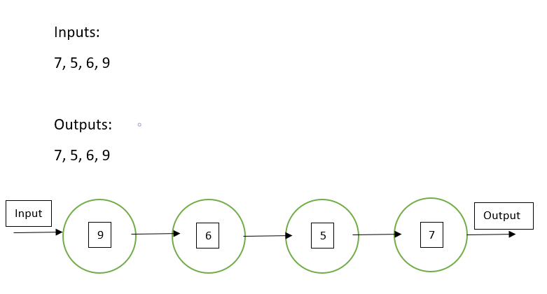

# Queues
Queues are the first data structure that we will be looking to learn more about. Queues are similar to stacks and they are a linear data structure. The factor that makes queues unique are the FIFO storage method.
## FIFO
FIFO stands for first in first out. You can think of this like when people enter a line in a grocery store, the first customer that is in the line gets served first. 

## Using Common Queue Commands in Python
There aren't many commands, if any, in Python that are specifically used for queues. Queues will mainly use the .append() and .pop() commands to implement. 
Queue Command | Description | Python Example | Speed (Big O)
------------- | ----------- | -------------- | -----
enqueue(variable) | Adds the value of variable to the end of the queue | new_queue.append(variable) | O(1)
dequeue(variable) | This will remove the first item from the queue to either return or pop it. | value = my_queue[0] del my_queue[0] or value = my_queue.pop(0) | O(n)

I like to think of treating queues kind of like a list in except I have to remember that the variables have to be listed in the order they came in and must leave in the order they came in.
## Queue Examples
Real world examples of practical uses of queues include the design of computers accessing a web server or some other kind of network access point. Another example of a queue is one that happens in your computer each time you use it. If you have ever used task manager in a Windows machine, you can view all the processes your computer is running. Each of those processes is in a queue 

## Problem to Solve
Technology Support Tier 1 Help Line:

Design a simple queue that will take phone calls in the order they are recieved. Design it so it will display all active calls as well as a way to dequeue a call after it is finished. Also have an option to display the size of the queue.

Here is a template to get started on the problem:

- [Template](1-problemTemplate.py)

## Possible Solution

- [Solution](1-solution1.py)