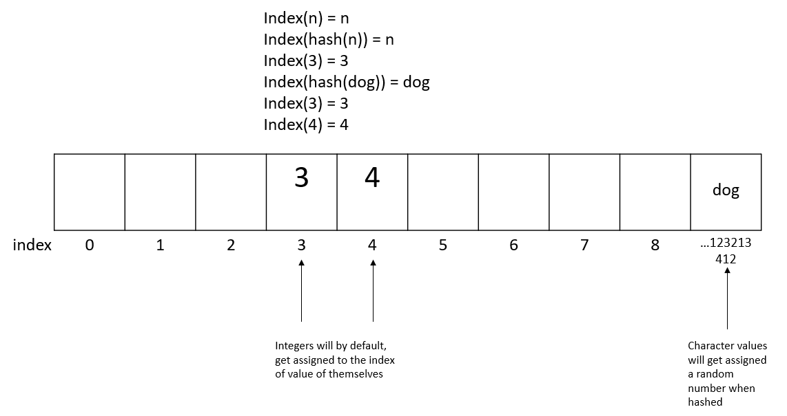

# Sets
In contrast to queues, where the order in which the data is entered matters, the order does not matter when using sets in data structures. 
## Identifying Sets
The aspect that sets sets apart from other data structures is they do not allow duplicates to be entered. This allows the set to be very effective in identifying if data is inside of it. One of the best ways to identify a variable in a set is by using hashing.
## Hashing
Hashing basically assigns a variable to a specific catalog number. After being hashed, each variable that enters the set that matches one already included in the set becomes a duplicate and is removed. When characters are entered, they are converted to an integer catalog number. This small example shows a way that we can get an O(1) efficiency while implementing the set data structure. 

One way we can compare this to another variable type in Python is in a list with a specific size. If we set a list to have a specific size, this would eliminate one of the ways we could get duplicates. The most efficient way we could implement this is by assigning each variable to a place in the list.
## Conflicts with Sets
There are situations where there can be a conflict with the placing of data in a set which can pile up quickly and cause performance issues. If you have a specific list size that you want to put data into and more than one object falls into the same index, there is the obvious conflict. There are two strategies to deal with these conflicts, open addressing and chaining. 

If using open addressing, once you identify that there is a conflict in one index, the new value of data then takes the place of the next available index. This can cause performance issues as more and more indexes are taken. When using chaining, once you there is a conflict, a list is made with all of the values that occupy that index. This now eliminates the fast searching feature because it now has to search both the index and the list inside of the index.
## Common Set Commands
Set Command | Description | Python Example | Speed (Big O)
------------- | ----------- | -------------- | -------------
add(value) | Adds value to set | new_set.add(value) | O(1)
remove(value) | Removes value from set | new_set.remove(value) | O(1)
member(value) | Checks to see if value in set | if value in new_set: | O(1)
size() | Checks the size of the set | length = len(new_set) | O(1)
## Set Example
In my opinion the some of the best uses for a set would be for a computer network's security. A good example of this are when network engineers track IPs or users that have accessed a computer network. Using a set you can very quickly identify either the user or the IP that has accessed the system, rather than having to search through each one. 
## Problem to Solve
Demonstrate your ability to use a simple case of sets to add users to an empty set, try to add a duplicate user to the set, and then check to see if a user is inside of the set and remove a specific user from the set.
- [Problem](2-problemTemplate2.py)
## Possible Solution
- [Solution](2-solution2.py)
