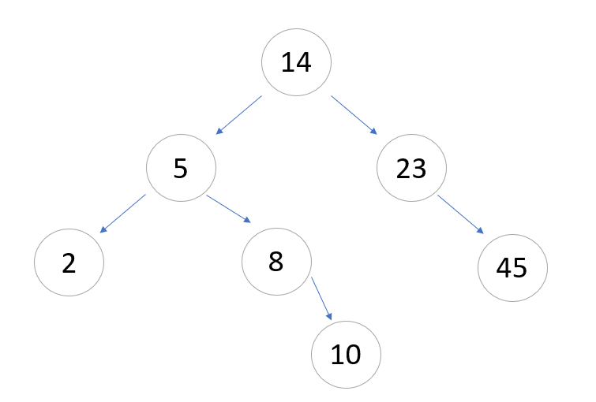
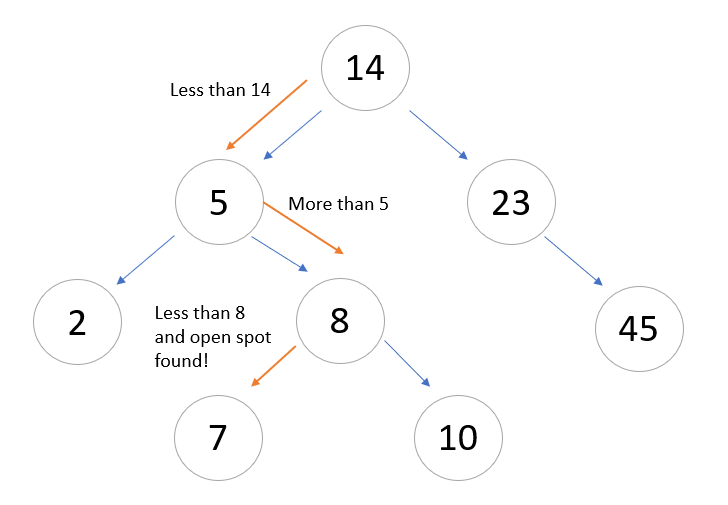

# Trees
## Introduction
Trees are the first non-linear data structure that we will be looking at. The data inside of trees are all insides of nodes and these nodes are all connected by pointers. We will set one of these nodes as the root node, where all of the others will stem off of.
## Binary Trees
In the binary tree structure, there are several different ways we identify nodes. The very top node is the root node like mentioned before. Below them can be parent nodes, child nodes, and leaf nodes. What makes a node a parent node is when it has connected other nodes. The node that is connected to a parent node is called the child node. And the leaf node is a node that is not connected to any other nodes below it.
## Binary Search Trees
A binary search tree has to follow rules for the data that gets put inside it. Data that gets put inside of a BST (binary search tree) gets compared to the parent node in order to be placed. If the value of the data is greater than the parent node, it gets placed to the right, and if the value is less than the parent node, it gets placed to the left. If there is data that already occupys the node either to the right or left, the process to find an empty spot continues. 
Here is an example:



Here is the process if a 7 was added to the BST:


## Recursion
Recursion will be used frequently in your implementation of trees in python. What recursion is, is the process of defining something in terms of itself. Something along the lines of calling a function within itself. Recursion will run until the bounds that you set are satified. Python however will stop whenever it knows there is an infinite recursion, by default the maximum amount of recursion that can be hit is 1000 times.
## Tree Examples
Tree Command | Description | Speed (Big O)
------------- | ----------- | -------------- |
insert(value) | Adds value to tree | O(log n)
remove(value) | Removes value from tree | O(log n)
contains(value) | Checks to see if value in tree | O(log n)
traverse_forward | Goes to all values from smallest to largest | O(n)
traverse_reverse | Goes to all values from largest to smallest | O(n)
height(node) | Get the height of a node. You can also get the height of the whole tree if you use the root node. | O(n)
size() | Get the size of the BST | O(1)
empty() | Checks to see if the tree is empty or size 0 | O(1)

Here are examples of how to implement these commands in python:

```python
def insert(self, data):
        # Starts the insert at the root
        if self.root is None:
            self.root = BST.Node(data)
        else:
            self._insert(data, self.root)

def _insert(self, data, node):
        # This will run through the tree and insert the value to an empty node based on the rules of the tree data structure.
        if data == node.data:
            return
        else:
            if data < node.data:
                if node.left is None:
                    node.left = BST.Node(data)
                else:
                    self._insert(data, node.left)
            else:
                if node.right is None:
                    node.right = BST.Node(data)
                else:
                    self._insert(data, node.right)

def __iter__(self):
        # This is your iterate function that will start at the root node.
        yield from self._traverse_forward(self.root)
        
    def _traverse_forward(self, node):
        # This will iterate through the data using recursion and will "yield" the result from the smallest value to the greatest value. The yield function acts as a return but will not stop a loop. So it will return the value it is set to yield then continue through the loop.
        if node is not None:
            yield from self._traverse_forward(node.left)
            yield node.data
            yield from self._traverse_forward(node.right)
```
## Problem to Solve

Given the provided code below. Use the data given to create a function that will get the height of the tree that has been created. The function should return the height of the tree of the greatest branch (whichever of the right or left direction is the greatest). Then as the tree grows, return the new height of the tree.
- [Problem](3-problemTemplate3.py)
## Possible Solution
- [Solution](3-solution3.py)